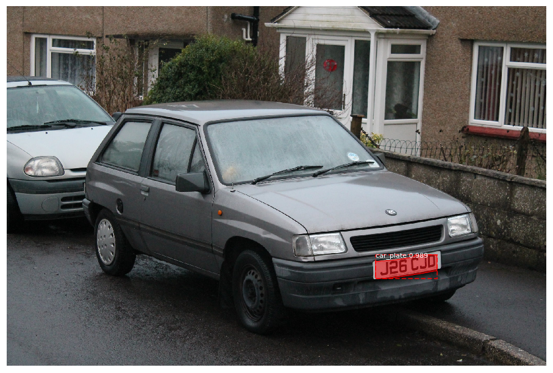
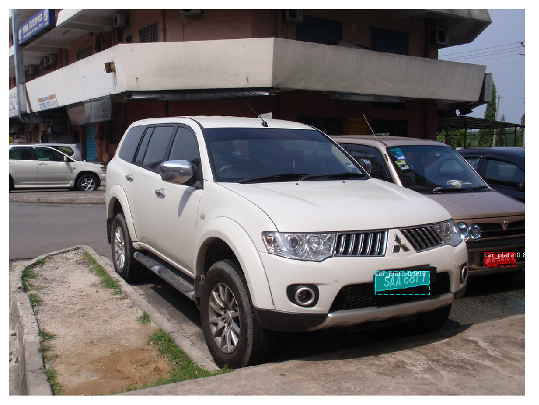

# Image-Segmentation-using-Mask-RCNN
This code is based on:

https://github.com/matterport/Mask_RCNN/blob/v2.1/samples/balloon/balloon.py

'''
Mask R-CNN
Train on the toy Balloon dataset and implement color splash effect.
Copyright (c) 2018 Matterport, Inc.
Licensed under the MIT License (see LICENSE for details)
Written by Waleed Abdulla
'''

I used Matterport's COCO model and the Balloon example as my base model. Then retrained my new model to detect car plate by tranfer learning. Here are the main procedures I did:

0. Prerequisite

In order to run the code, you need to first clone or download the Matterport's repositories at:

https://github.com/matterport/Mask_RCNN

and read installation information to install the setup.py file.

1. Prepare my own dataset

Since you have your own specific detection goals, you need to prepare your dataset from scratch instead of simply downloading from some websites. Here's what I did:

1.1 Download images of car plate from flickr.com
I downloaded about 65 images (47 for training, 18 for testing). The reason why I didn't use "1 million samples" to train is that

https://engineering.matterport.com/splash-of-color-instance-segmentation-with-mask-r-cnn-and-tensorflow-7c761e238b46

"First, transfer learning. Which simply means that, instead of training a model from scratch, I start with a weights file that’s been trained on the COCO dataset (we provide that in the github repo)." 
"So the trained weights have already learned a lot of the features common in natural images, which really helps. And, second, given the simple use case here, I’m not demanding high accuracy from this model, so the tiny dataset should suffice."

1.2 Annotate images

I used the author suggested tool VIA to do the annotation work. Basically, import your images, draw the masks on the image, config the region attributes, and save it to a .json file. Don't forget to put it with your images together.

1.3 Load the dataset

This part is a little tricky and you may need sometime to debug.

Eventhough the author gave his example how to load the dataset for training and testing, you still have to do some coding/formating jobs depending on your notebook and your own .json file.

You may find it annoying when parsing the.json file. The format of the file I created is different from the example. It has a structure like "dictionaries in dictionaries". A good way to do the parsing is to print the whole file first, then look for what you want "layer by layer", like peeling an onion.

2. Train the model

Before training, you need to do some config and preprocessing job. Don't worry. The nice author has provided an example and some necessary functions for you to use. All you need to do is some modification. Then, here we go. Let's wait for the training...(The training time depends on your computer's config. I am using an old Macpro and it took about 20 hours...)

3. Use the model

Finally, when the training marathon finished, you are entering the fun part. Remember, the mrcnn model doesn't provide functions like model.save_weights, model.predict, etc. The weight.h5 file is saved in the foler automatically when the training is done. For prediction, you need to do: 

load the mrcnn model again using "inference mode", and

load your newly trained weights

Use model.detect and display_instances functions the author provided

Enjoy!

Two cars? No prob.

Reference:

1. https://github.com/matterport/Mask_RCNN

2. Mask RCNN, 2017

3. https://engineering.matterport.com/splash-of-color-instance-segmentation-with-mask-r-cnn-and-tensorflow-7c761e238b46

4. https://machinelearningmastery.com/how-to-perform-object-detection-in-photographs-with-mask-r-cnn-in-keras/

